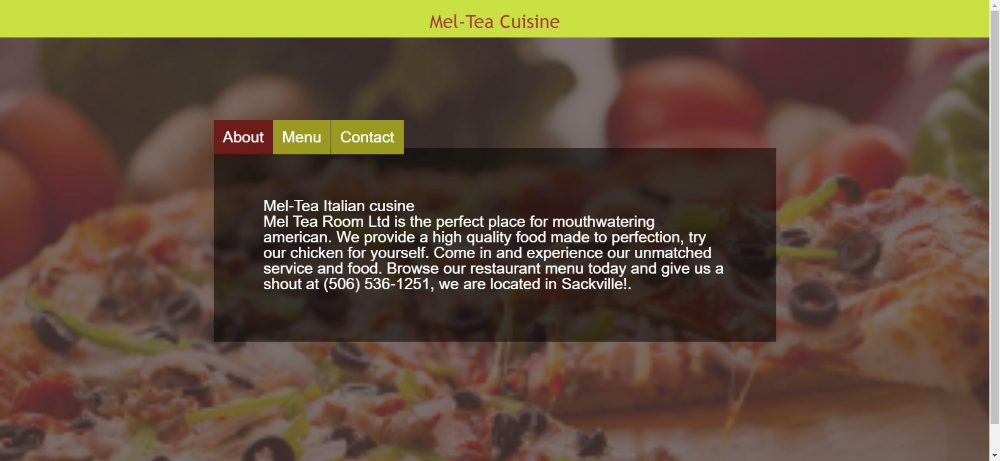

# Restaurant

This project is about a restaurant web page built only with JavaScript. The home page consists of tabs with:
- About Information
- The menu
- Contact Information

## [Live Link](https://rawcdn.githack.com/AkintoyeOlamide/Resturant/ad878932800b3b0ba47e9bc59e6747667cfee62f/dist/index.html)

## Built With

- JavaScript
- CSS

## Getting Started

To set up a local copy of the project

- `git clone https://github.com/AkintoyeOlamide/Resturant.git`
- `cd Restaurant`
- `npm install` to install dependencies

## Author

👤 **Akintoye Olamide**

- GitHub: [akintoye Olamide](https://github.com/AkintoyeOlamide)

## 🤝 Contributing

Contributions, issues, and feature requests are welcome!

## Show your support

Give a ⭐️ if you like this project!

## Acknowledgments

## 📝MIT License.